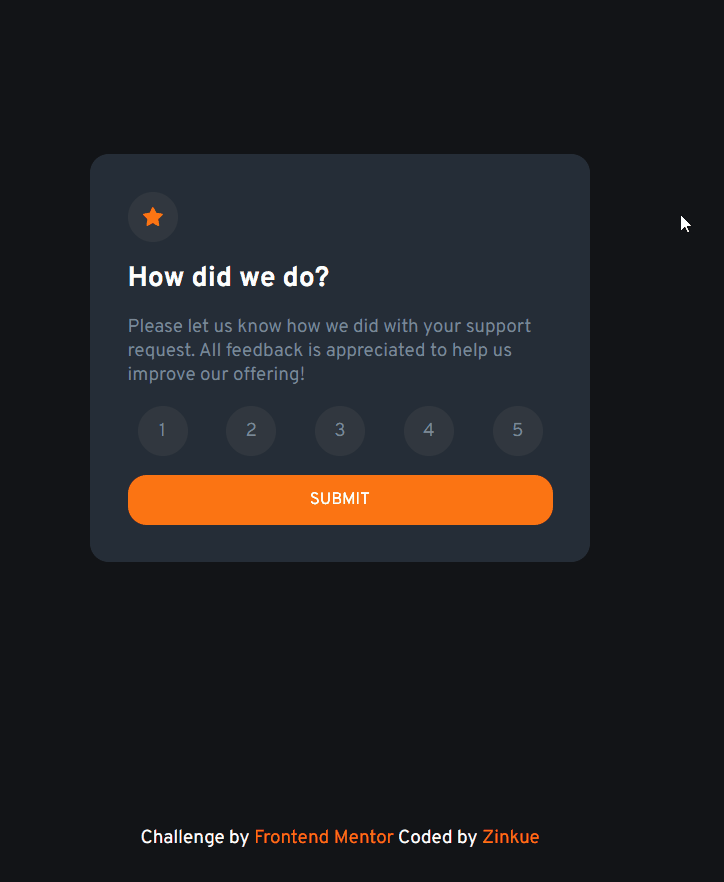

# Frontend Mentor - Interactive rating component solution

This is a solution to the [Interactive rating component challenge on Frontend Mentor](https://www.frontendmentor.io/challenges/interactive-rating-component-koxpeBUmI). Frontend Mentor challenges help you improve your coding skills by building realistic projects. 

## Table of contents

- [Overview](#overview)
  - [The challenge](#the-challenge)
  - [Screenshot](#screenshot)
  - [Links](#links)
- [My process](#my-process)
  - [Built with](#built-with)
  - [What I learned](#what-i-learned)
  - [Useful resources](#useful-resources)

## Overview

### The challenge

Users should be able to:

- View the optimal layout for the app depending on their device's screen size
- See hover states for all interactive elements on the page
- Select and submit a number rating
- See the "Thank you" card state after submitting a rating

### Screenshot



### Links

- [Solution URL](https://zinkue.github.io/Interactive-rating-component/)

## My process

### Built with

- Flexbox
- CSS Grid
- Mobile-first workflow
- Vanilla JavaScript

### What I learned

Where add a JS file in HTML
```html
  <script src="script.js"></script>
</body>
```

How to import Google Fonts cleaner
```css
@import url('https://fonts.googleapis.com/css2?family=Overpass:wght@400;700&display=swap');
```

Usage of CSS selectors
```css
.input-score:checked + .label-score {
    background-color: var(--orange);
    color: var(--white);
}
```

How to access form values (searched in Google)
```js
const elements = document.getElementById("form");
const value = elements["score"].value;
```

### Useful resources

- [Restart animation CSS](https://stackoverflow.com/questions/6268508/restart-animation-in-css3-any-better-way-than-removing-the-element) - This helped me understanding how to restart an animation in CSS.
- [Custom checkbox CSS](https://www.w3schools.com/howto/howto_css_custom_checkbox.asp) - This helped me how to create custom checkbox for forms and CSS selectors.
